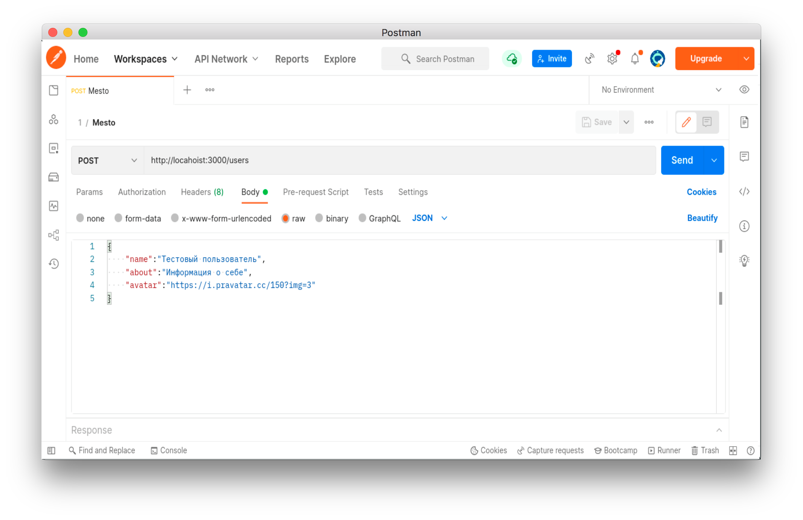
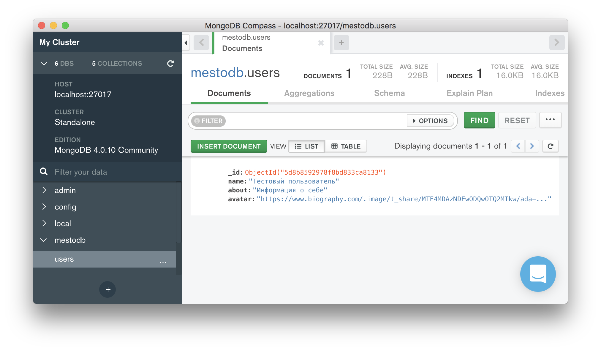
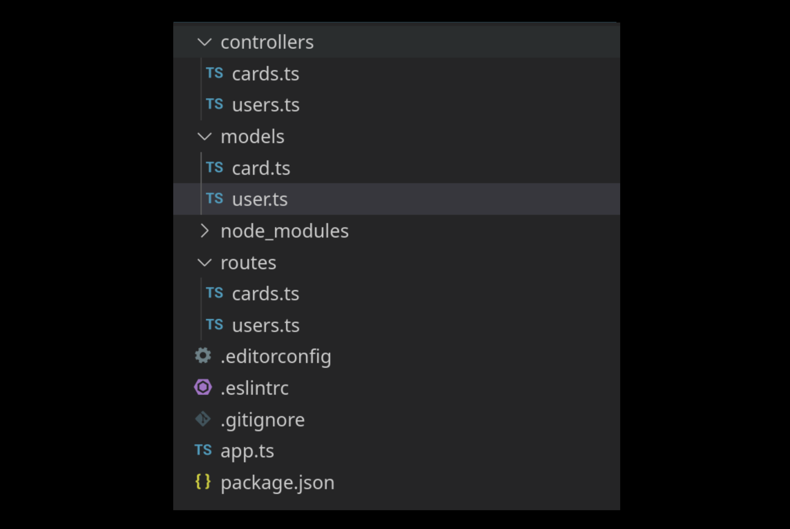

# Бэкенд Mesto. Каркас API Mesto

## Используемые технологии и решения

- Typescript в качестве основного языка проекта
- Mongodb и ODM Mongoose для хранения данных пользователей
- Node.js в качестве среды выполнения

# Первый этап: нужно реализовать Каркас API Mesto

В самостоятельных проектах курса по JavaScript вы работали над проектом Mesto. Но одна из частей проекта так и осталась скрытой — работа сервера. Он умеет проверять токены, регистрировать и авторизовывать пользователей, сохранять и отдавать карточки, запоминать, когда кто-то поставил лайк или передумал и убрал его.

Вам предстоит разработать такой бэкенд для сервиса Место самостоятельно и с нуля!

**Инфраструктура проекта**

Создайте папку с проектом и инициализируйте в ней package.json. Поля name и author заполните на своё усмотрение.

**Добавьте конфигурацию компилятора TypeScript**

В корень проекта добавьте файл tsconfig.json со следующим содержимым:

```json
{
  "compilerOptions": {
    /* Set the JavaScript language version for emitted JavaScript and include compatible library declarations. */
    "target": "es6",
    /* Modules */
    "module": "commonjs" /* Specify what module code is generated. */,
    "baseUrl": "./src",
    "moduleResolution": "node" /* Specify how TypeScript looks up a file from a given module specifier. */,
    /* JavaScript Support */
    "allowJs": true /* Allow JavaScript files to be a part of your program. Use the 'checkJS' option to get errors from these files. */,
    "checkJs": false /* Enable error reporting in type-checked JavaScript files. */,
    "outDir": "./dist" /* Specify an output folder for all emitted files. */,
    "esModuleInterop": true /* Emit additional JavaScript to ease support for importing CommonJS modules. This enables 'allowSyntheticDefaultImports' for type compatibility. */,
    "forceConsistentCasingInFileNames": true /* Ensure that casing is correct in imports. */,
    /* Type Checking */
    "strict": true /* Enable all strict type-checking options. */,
    /* Completeness */
    "skipLibCheck": true /* Skip type checking all .d.ts files. */
  },
  "include": ["src/**/*.ts"],
  "exclude": ["node_modules"]
}
```

Обратите внимание на значения параметров:

- baseUrl — директория с исходным кодом проекта на TypeScript;
- outDir — директория с результатами сборки (в ней будет лежать код проекта на JavaScript).

**Настройте editorconfig**

Можно бесконечно смотреть на огонь, воду и спорить, чем отбивать код: табами или пробелами. А можно просто создать файл .editorconfig и скопировать туда настройки:

```r
# http://editorconfig.org

# A special property that should be specified at the top of the file outside of
# any sections. Set to true to stop .editor config file search on current file
root = true

[*]
# Indentation style
# Possible values - tab, space
indent_style = space

# Indentation size in single-spaced characters
# Possible values - an integer, tab
indent_size = 2

# Line ending file format
# Possible values - lf, crlf, cr
end_of_line = lf

# File character encoding
# Possible values - latin1, utf-8, utf-16be, utf-16le
charset = utf-8

# Denotes whether to trim whitespace at the end of lines
# Possible values - true, false
trim_trailing_whitespace = true

[*.md]
trim_trailing_whitespace = false

# Denotes whether file should end with a newline
# Possible values - true, false
insert_final_newline = true
```

Вам понадобится расширение “EditorConfig” для VS Code.

Настройте линтер
Мы будем работать по самому популярному стайлгайду — Airbnb. Для начала установите три dev-зависимости:

- Сам ESLint. [Инструкцию можно найти по ссылке.](https://www.npmjs.com/package/eslint)

- Ещё четыре dev-зависимости, чтобы линтер работал по правилам стайлгайда Airbnb:

```bash
eslint-config-airbnb-base
eslint-plugin-import
@typescript-eslint/eslint-plugin
@typescript-eslint/parser
```

Сделать это можно при помощи следующей команды: npx install-peerdeps --dev eslint-config-airbnb-base

В корне проекта создайте файл .eslintrc и добавьте в него:

```json
{
  "env": {
    "es2021": true,
    "node": true
  },
  "extends": ["airbnb-base"],
  "parser": "@typescript-eslint/parser",
  "parserOptions": {
    "ecmaVersion": "latest",
    "sourceType": "module"
  },
  "plugins": ["@typescript-eslint"],
  "settings": {
    "import/resolver": {
      "node": {
        "extensions": [".ts", ".js", ".json"]
      }
    },
    "import/extensions": [".js", ".ts"]
  },
  "rules": {
    "import/extensions": [
      "error",
      "ignorePackages",
      {
        "js": "never",
        "ts": "never"
      }
    ]
  }
}
```

В файл package.json добавьте новую команду lint. При её запуске выполняется запуск eslint: npx eslint src/\*_/_.ts. После выполнения в консоли не должно быть сообщений об ошибках.

**Добавьте исключение**

Согласно стайлгайду Airbnb, в JavaScript не следует использовать нижние подчёркивания для имён идентификаторов, поэтому ESLint будет ругаться на переменную \_id в файлах проекта.

Изменим это правило. Для этого в файл .eslintrc добавьте исключение для идентификатора \_id. Вот материалы, которые помогут вам разобраться, как именно это сделать:

- [Инструкция по конфигурации правил линтера.](https://eslint.org/docs/latest/use/configure/#using-configuration-files)
- [Инструкция по настройке нужного правила.](https://eslint.org/docs/rules/no-underscore-dangle#options)

Вам могут пригодиться:

- [Стайлгайд Airbnb.](https://github.com/airbnb/javascript)
- [Перевод на русский от сообщества разработчиков.](https://github.com/leonidlebedev/javascript-airbnb)
- [Конфигурация ESLint по стайлгайду Airbnb.](https://www.npmjs.com/package/eslint-config-airbnb-base)

И последнее: вам понадобится расширение “ESLint” для VS Code.

Добавьте исключения в Git
Создайте файл .gitignore:

```r
# Logs
logs
*.log
npm-debug.log*

# Dependency directory
node_modules

# Optional npm cache directory
.npm

# Optional REPL history
.DS_Store
.idea
.vscode

# Typescript build result
dist
```

**Создайте первый TS-файл**

В корне проекта создайте директорию src и поместите туда точку входа в проект — файл app.ts. Заведите в нём express-сервер и настройте его запуск на 3000 порту по команде:

```bash
npm run start
```

Данная команда должна осуществлять запуск проекта без его непосредственной сборки при помощи ts-node.

**Добавьте команду сборки проекта**

Добавьте npm-скрипт для сборки проекта при помощи компилятора TypeScript. Сборка проекта должна осуществляться при помощи команды npm run build. В результате выполнения команды скомпилированный JS-код проекта должен появиться в директории с билдом (dist).

Убедитесь в корректной работе команды, выполнив команду npm run build , и проверьте содержимое директории dist.

**Настройте хот-релоуд**

Сделайте так, чтобы сервер перезапускался при изменении файлов проекта. Для этого установите пакет ts-node-dev. Приложение с хот релоудом должно запускаться командой:

```bash
npm run dev
```

**База данных, контроллеры и роуты для карточек и пользователей**

**Подключитесь к MongoDB**

В app.ts подключитесь к серверу MongoDB по адресу:

```bash
mongodb://localhost:27017/mestodb
```

mestodb — имя базы данных, которая будет создана.

### Создайте схемы и модели

В проекте две сущности: пользователь и карточки. Создайте схему и модель для каждого.

**Поля схемы пользователя:**

- name — имя пользователя, строка от 2 до 30 символов, обязательное поле;
- about — информация о пользователе, строка от 2 до 200 символов, обязательное поле;
- avatar — ссылка на аватарку, строка, обязательное поле.

**Поля схемы карточки:**

- name — имя карточки, строка от 2 до 30 символов, обязательное поле;
- link — ссылка на картинку, строка, обязательно поле.
- owner — ссылка на модель автора карточки, тип ObjectId, обязательное поле;
- likes — список лайкнувших пост пользователей, массив ObjectId, по умолчанию — пустой массив (поле default);
- createdAt — дата создания, тип Date, значение по умолчанию Date.now.

Модель пользователя назовите user, карточки — card. Для этого передайте имена моделей первым аргументом методу mongoose.model:

```ts
// TS-интерфейс модели User

export default mongoose.model<User>('user', userSchema);
```

**Создайте контроллеры и роуты для пользователей**

Реализуйте три роута:

```
GET /users — возвращает всех пользователей
GET /users/:userId - возвращает пользователя по _id
POST /users — создаёт пользователя
```

В теле POST-запроса на создание пользователя передайте JSON-объект с тремя полями: name, about и avatar.

**Создайте тестового пользователя**

Воспользуйтесь Postman:


Затем откройте Compass — там должна появиться база данных с именем mestodb. Имя мы задали во втором пункте инструкции при подключении базы.

В базе появится коллекция users с одним пользователем, которого вы только что создали.

Скопируйте куда-нибудь \_id этого пользователя, он сейчас нам понадобится.

**Реализуйте временное решение авторизации**

В карточке есть поле owner для хранения её автора. Но в запросе клиент передаёт только имя карточки и ссылку на картинку. В следующей теме вы узнаете, как решить эту проблему, а пока реализуйте временное решение.

В файле app.ts создайте вот такой мидлвар:

```ts
app.use((req, res, next) => {
  req.user = {
    _id: '5d8b8592978f8bd833ca8133', // вставьте сюда _id созданного в предыдущем пункте пользователя
  };

  next();
});
```

Он добавляет в каждый запрос объект user. Берите из него идентификатор пользователя в контроллере создания карточки:

```ts
const createCard = (req, res) => {
  console.log(req.user._id); // _id станет доступен
};

export createCard;
```

Это временное решение. Мы захардкодили идентификатор пользователя, поэтому кто бы ни создал карточку, в базе у неё будет один и тот же автор.

**Создайте контроллеры и роуты для карточек**

Реализуйте три роута:

```
GET /cards — возвращает все карточки
POST /cards — создаёт карточку
DELETE /cards/:cardId — удаляет карточку по идентификатору
```

В теле POST-запроса на создание карточки передайте JSON-объект с двумя полями: name и link.

**Другие роуты карточек и пользователя**

Реализуйте ещё четыре роута:

```
PATCH /users/me — обновляет профиль
PATCH /users/me/avatar — обновляет аватар
PUT /cards/:cardId/likes — поставить лайк карточке
DELETE /cards/:cardId/likes — убрать лайк с карточки
```

В каждом роуте понадобится \_id пользователя, совершающего операцию. Получайте его из req.user.\_id.

Каждый пользователь может поставить только один лайк карточке. Поэтому массив лайков должен состоять из уникальных значений. Для этого нужно добавлять пользователя в массив, только если его там ещё нет. В MongoDB такая логика реализуется специальными операторами:

- $addToSet, чтобы добавить элемент в массив, если его там ещё нет;

- $pull, чтобы убрать.

```ts
const likeCard = (req, res) => Card.findByIdAndUpdate(
  req.params.cardId,
  { $addToSet: { likes: req.user._id } }, // добавить _id в массив, если его там нет
  { new: true },
)

const dislikeCard = (req, res) => Card.findByIdAndUpdate(
  req.params.cardId,
  { $pull: { likes: req.user._id } }, // убрать _id из массива
  { new: true },
)

// Экспортируем методы контроллера
export likeCard;
export dislikeCard;
```

**Обработка ошибок**
В случаях, если при запросе что-то пойдет не так — верните соответствующий код ошибки:

- 400 — переданы некорректные данные в методы создания карточки, пользователя, обновления аватара пользователя или профиля;

- 404 — карточка или пользователь не найден.

- 500 — ошибка по умолчанию.

Перед отправкой ошибки не забудьте проверить ее, например так:

```ts
const ERROR_CODE = 400;

if (err.name === 'SomeErrorName') return res.status(ERROR_CODE).send(...)
```

Ответ с ошибкой должен быть единообразен, как и другие штуки в серверной разработке. Используйте такой формат ответа с ошибкой:

```json
{
  "message": "Запрашиваемый пользователь не найден"
}
```

### Формат данных, приходящих от сервера

Поработайте над данными от сервера. Вы уже сталкивались с ними, когда работали с фронтенд частью приложения Mesto. Сделайте схожую структуру ответа на своём сервере, исключая ответы связанные с авторизацией и регистрацией пользователя.

Ведь важно, чтобы сервер в ответе возвращал ожидаемый результат. Например, при обращении к GET /users/:userId должен возвращаться следующий ответ:

```json
{
  "name": "Стас",
  "about": "Разработчик",
  "avatar": "https://arte1.ru/images/detailed/4/23608.jpg",
  "_id": "dd8b6dea22fe4ea0ad5d46f4"
}
```

Вы можете снова обратиться к проекту Mesto и подглядеть, какие ответы возвращает сервер.

**Что в итоге?**

Поздравляем! Вы написали основную часть архитектуры проекта. Когда решите все задачи, проект будет иметь похожую структуру:


Директория src содержит исходный код проекта на языке Typescript. В ней:

- app.ts включает основную логику сервера, запуск и подключение к базе данных;

- директория models/ содержит файлы описания схем пользователя и карточки;

- директория controllers/ содержит файлы описания моделей пользователя и карточки;

- директория routes/ содержит описание основных роутов для пользователя и карточки.

**Что с роутами и ошибками?**

Перед сдачей проектной работы соберём всю информацию о роутах: что они возвращают и какие ошибки возникают при обращении к ним. Перед тем, как сдавать проект, проверьте все эти роуты в Postman.
Ниже — итоговая таблица роутов, действий и возможных ошибок.

## Роуты пользователей и карточек

| Роут                 | Запрос     | Действие                                                                                                                                   | Ошибки                                                                                                                                 |
| -------------------- | ---------- | ------------------------------------------------------------------------------------------------------------------------------------------ | -------------------------------------------------------------------------------------------------------------------------------------- |
| /users               | GET``POST  | GET-запрос возвращает всех пользователей из базы данных; POST-запрос создаёт пользователя с переданными в теле запроса name, about, avatar | 400 — Переданы некорректные данные при создании пользователя. 500 — Ошибка по умолчанию.                                               |
| /users/:userId       | GET        | GET-запрос возвращает пользователя по переданному \_id.                                                                                    | 404 — Пользователь по указанному \_id не найден. 500 — Ошибка по умолчанию.                                                            |
| /users/me            | PATCH      | PATCH-запрос обновляет информацию о пользователе.                                                                                          | 400 — Переданы некорректные данные при обновлении профиля. 404 — Пользователь с указанным \_id не найден. 500 — Ошибка по умолчанию.   |
| /cards               | GET POST   | GET-запрос возвращает все карточки из базы данных. POST-запрос создает новую карточку по переданным параметрам.                            | 400 — Переданы некорректные данные при создании карточки. 500 — Ошибка по умолчанию.                                                   |
| /cards/:cardId       | DELETE     | DELETE-запрос удаляет карточку по \_id.                                                                                                    | 404 — Карточка с указанным \_id не найдена.                                                                                            |
| /cards/:cardId/likes | PUT DELETE | PUT-запрос добавляет лайк карточке. DELETE-запрос удаляет лайк с карточки.                                                                 | 400 — Переданы некорректные данные для постановки/снятии лайка. 404 — Передан несуществующий \_id карточки. 500 — Ошибка по умолчанию. |

**Заключение**

Вы почти полностью подготовили бэкенд для приложения Mesto. Да, сейчас в нём нет авторизации с регистрацией, а также полноценной валидации данных. Но в следующем проекте вы сложите этот пазл.

# Второй этап: Авторизация, валидация и логгирование.

К этому моменту ваш сервис реализует базовый функционал сервиса Mesto — он позволяет публиковать карточки, ставить (а затем убирать) лайки, хранить и обрабатывать информацию из профиля пользователя.

Осталась самая малость — научить его «узнавать» пользователя (реализовать авторизацию), добавить проверку корректности переданных данных (провалидировать их) и корректно и безопасно обработать возникающие в процессе работы ошибки (куда уж без них).
Но обо всем по порядку.

## Реализуйте авторизацию и регистрацию пользователя

1.**Добавьте email и password к схеме пользователя**

Регистрировать пользователей будем по почте и паролю. Поэтому в схему пользователя добавьте два поля: email и password. У каждого пользователя email должен быть уникальным и валидироваться на соответствие схеме электронной почты.

Для валидации воспользуйтесь модулем validator: https://www.npmjs.com/package/validator.

По умолчанию база возвращает поле password при запросе к модели пользователя. Пока не меняйте его — к этому вернёмся позже.

2.**Доработайте контроллер createUser**

Помимо полей name, about и avatar, он должен добавлять поля email и password. Хешируйте пароль, прежде чем сохранять его в базу.

Поля name, about и avatar сделайте необязательными. Если при создании пользователя эти поля не были указаны, то им должны присваиваться стандартные значения — для этого доработайте схему user. Подробнее [про стандартные значения вы можете прочитать здесь.](https://mongoosejs.com/docs/defaults.html#declaring-defaults-in-your-schema)

Для этих полей используйте следующие стандартные значения из макета предыдущих спринтов:

- name — «Жак-Ив Кусто»;

- about — «Исследователь»;

- avatar — ссылка;

Данные всех полей должны приходить в теле запроса.

3. **Создайте контроллер login**

В файле controllers/users.ts создайте контроллер login, который получает из запроса почту и пароль и проверяет их. Если почта и пароль правильные, контроллер должен создавать JWT сроком на неделю. В пейлоуд токена следует записывать только свойство \_id, которое содержит идентификатор пользователя:

```ts
{
  _id: 'd285e3dceed844f902650f40';
}
```

JWT после создания должен быть отправлен клиенту. Мы рекомендуем записывать JWT в httpOnly куку. Если вам проще сделать это в теле ответа, такое решение тоже будет принято.

При неправильных почте и пароле контроллер должен вернуть ошибку 401.

4. **Создайте роут для логина и регистрации**

В app.ts создайте два обработчика POST-запросов на два роута: '/signin' и '/signup':

```ts
app.post('/signin', login);
app.post('/signup', createUser);
```

Передайте им соответствующие контроллеры — login и createUser. Из файла routes/users.ts удалите обработчик создания пользователя — он больше не нужен.

5. **Сделайте мидлвар для авторизации**

В файле middlewares/auth.ts создайте мидлвар для авторизации. Он должен верифицировать токен из заголовков. Если с токеном всё в порядке, мидлвар должен добавлять пейлоуд токена в объект запроса и вызывать next:

```ts
req.user = payload;
next();
```

Если с токеном что-то не так, мидлвар должен вернуть ошибку 401.

6. **Создайте контроллер и роут для получения информации о пользователе**

Реализуйте роут:

```
GET /users/me - возвращает информацию о текущем пользователе
```

7. **Защитите API авторизацией**

Защитите авторизацией все маршруты, кроме страницы регистрации и логина. При попытке неавторизованного пользователя обратиться к защищённому маршруту — возвращайте 401 ошибку.

8. **Удалите хардкод**

В предыдущем проекте мы добавили такой мидлвар, поскольку тогда вы ещё не умели реализовывать авторизацию:

```ts
app.use((req, res, next) => {
  req.user = {
    _id: '5d8b8592978f8bd833ca8133',
  };

  next();
});
```

Теперь авторизация готова, поэтому удалите этот мидлвар.

9. **Проконтролируйте права**

У пользователя не должно быть возможности удалять карточки других пользователей.

10. **Сделайте так, чтобы API не возвращал хеш пароля**

В соответствующее поле схемы пользователя нужно добавить свойство select со значением false:

```ts
const userSchema = new Schema({
  // ...
  password: {
    type: String,
    required: true,
    select: false, // необходимо добавить поле select
  },
  // ...
});
```

Так по умолчанию хеш пароля пользователя не будет возвращаться из базы.

Но в случае аутентификации хеш пароля нужен. Чтобы это реализовать, после вызова метода модели, нужно добавить вызов метода select, передав ему строку +password:

```ts
User.findOne({ email })
  .select('+password')
  .then((user) => {
    // здесь в объекте user будет хеш пароля
  });
```

11. **Реализуйте логирование запросов и ошибок**

Каждый запрос к API должен сохраняться в файле request.log. Если API возвращает ошибку, информация о ней должна сохраняться в файле error.log.
Сохраняйте логи в формате JSON и не добавляйте файлы логов в репозиторий.

## Последние штрихи

1. **Реализуйте централизованную обработку ошибок**

Создайте мидлвар для централизованной обработки ошибок. В местах возникновения ошибок больше не возвращайте их, а передавайте обработку в этот мидлвар.

Проследите за тем, чтобы API не возвращал объект ошибки в том виде, в котором он возник. Например, такого быть не должно:

```ts
.catch(err => res.send(err))
```

В случае, если на сервере возникает ошибка, которую мы не предусмотрели, возвращайте ошибку 500.

В процессе работы с регистрацией и авторизацией у вас появились новые роуты и методы в контроллерах. Не забудьте обработать ошибки и там.

Учтите также случай, когда пользователь пытается зарегистрироваться по уже существующему в базе email. Для этого вам пригодится 409 код ошибки и следующая конструкция:

```ts
if (err.code === 11000) {
  // Обработка ошибки
}
```

Такую ошибку и код отдает сама база данных при попытке создать дубликат уникального поля.

Если при попытке авторизоваться присланный токен некорректен — возвращайте 401 статус-код.

2. **Валидируйте приходящие на сервер запросы**

Тела запросов к серверу должны валидироваться до передачи обработки в контроллеры. Если запрос принимает какую-то информацию в заголовках или параметрах, валидируйте и её.

API должен возвращать ошибку, если запрос не соответствует схеме, которую мы определили.

3. **Валидируйте данные на уровне схемы**

Для проверки данных поля avatar используйте регулярное выражение.

Убедитесь, что ссылка на аватар выполняет условия:

1. Начинается с http:// или https://.

2. www. — это необязательная группа.

3. Путь — последовательность из цифр, латинских букв и символов -.\_~:/?#[]@!$&'()\*+,;=, указанных после названия домена и доменной зоны. На конце пути может стоять решётка #.

4. Шаблон находит URL таких форматов:

```
http://ya.ru
https://www.ya.ru
http://2-domains.ru
http://ya.ru/path/to/deep/
http://ya-ya-ya.ru
```

URL без указания доменной зоны не должен проходить валидацию, например:

```
http://ya
https://www.ya
```

В этом задании самостоятельно разберитесь, как валидировать ссылки. Это описано в документации Mongoose: https://mongoosejs.com/docs/validation.html.

**Рекомендую для ознакомления:**

- [Возможные исключения в mongoose и когда они могут возникать](https://mongoosejs.com/docs/api/error.html)

- [Десять соглашений об именовании JavaScript, которые должен знать каждый разработчик](https://www.dev-notes.ru/articles/javascript/ten-js-naming-conventions-every-developer-should-know/)

- [Кратко о нейминге в JS](https://habr.com/ru/articles/488378/)

- [О методе orFail](https://mongoosejs.com/docs/api.html#query_Query-orFail)

- [Асинхронность в JS](https://www.youtube.com/watch?v=x0Y3TfkvCgY)
